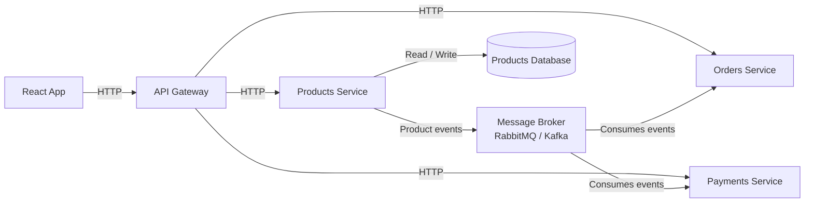

# Products Service Architecture

HTTP traffic flows from the React frontend through an API gateway to the backend services.

The Products Service persists product data in its database and publishes product-related events that downstream services can consume asynchronously.